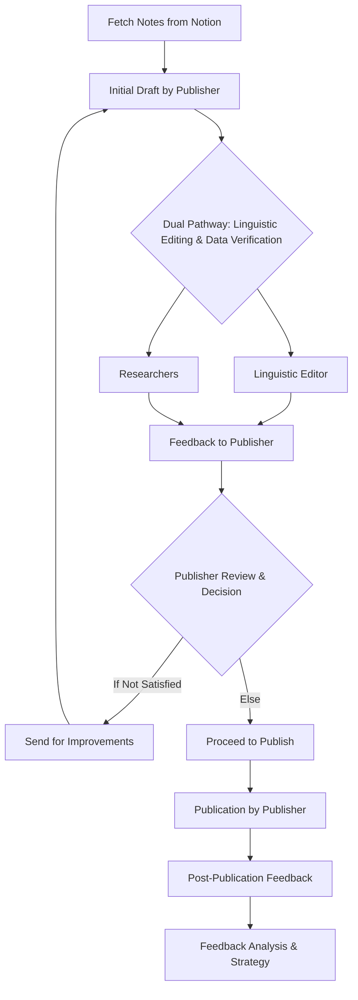

1. **Fetch Notes from Notion**
    - **Action:** Retrieve blog notes with their respective statuses.
2. **Initial Draft by Publisher**
    - **Action:**
        - The Publisher agent drafts the initial blog post.
        - Forward the draft to both the Linguistic Editor for linguistic review and the Researchers for data verification.
3. **Linguistic Editing**
    - **Task:** Enhance the draft's grammar, style, and overall coherence.
    - **Feedback:**
        - Return the revised draft to the Publisher with suggestions.
4. **Data Verification by Researchers**
    - **Action:**
        - Verify the accuracy and completeness of data.
        - Provide data feedback and any required additional information to the Publisher.
5. **Publisher Review**
    - **Decision:**
        - The Publisher evaluates all feedback and revisions.
        - If the draft is satisfactory:
            - Proceed to publishing.
        - If not satisfied:
            - Send the draft back to either the Linguistic Editor for further linguistic enhancements or Researchers for data improvements, as needed.
6. **Publication by Publisher**
    - **Action:**
        - Upon satisfying all quality assessments, the Publisher finalizes and publishes the blog post.
7. **Post-Publication Feedback**
    - **Task:** Collect and analyze audience engagement and feedback.
    - **Continuous Improvement:**
        - Use these insights to guide future content strategies and improve the overall process.

### Visualizing the Updated Workflow



```
[Fetch Notes from Notion]
           ↓
[Initial Draft by Publisher]
           ↓
[Dual Pathway: Linguistic Editing & Data Verification]
     ↙                 ↘
[Linguistic Editor]     [Researchers]
    ↓                      ↓
[Feedback to Publisher]   [Feedback to Publisher]
           ↓
   [Publisher Review & Decision]
           ↓
  [If Not Satisfied: Send for Improvements]
           ↖
         [Else: Proceed to Publish]
           ↓
   [Publication by Publisher]
           ↓
[Post-Publication Feedback]
           ↓
   [Feedback Analysis & Strategy]

```

### Key Considerations

- **Central Control:** The Publisher maintains control and is the final authority on when a post is ready to go live.
- **Iterative Feedback:** Allow for multiple rounds of feedback and revision until the Publisher deems the content satisfactory.
- **Communication:** Ensure clear channels for agents to promptly address feedback and make necessary revisions.

This streamlined process ensures high-quality content that meets both linguistic standards and factual accuracy, while allowing the Publisher to effectively manage and direct the final approval and publication stages.
